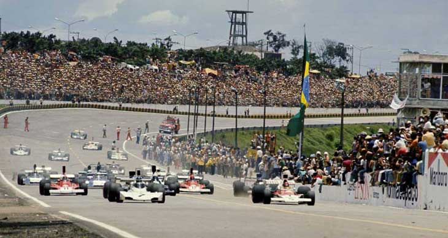
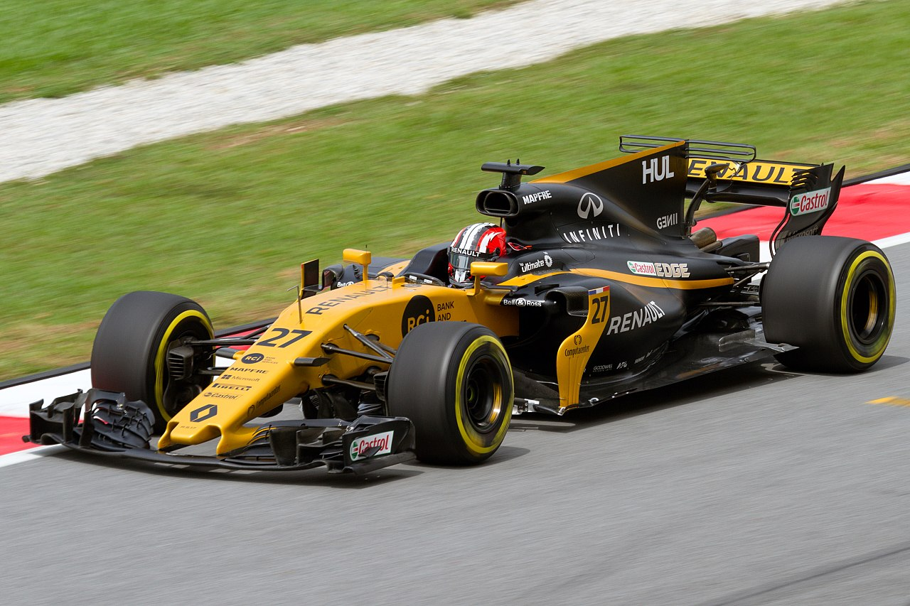
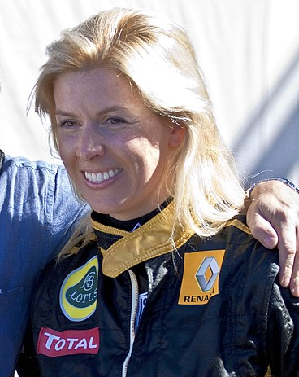
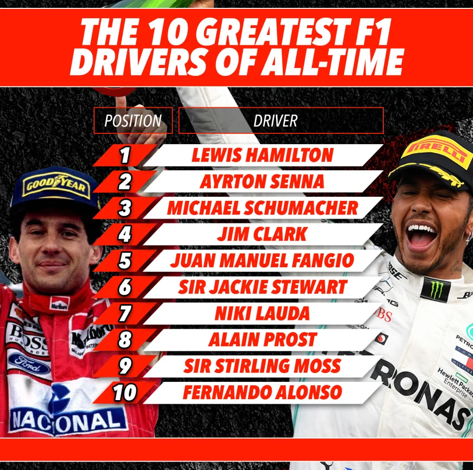
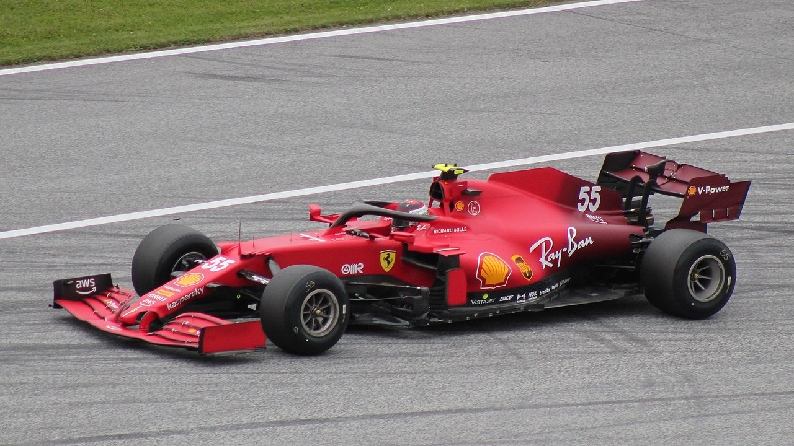

```{r, echo=FALSE}
htmltools::img(src = knitr::image_uri(file.path("logo.jpg")), 
               alt = 'logo', 
               style = 'position:absolute; top:0; right:0; padding:10px;',
               width="200",
               height="100")
```


# FORMULA 1 all time drivers analysis


## First approach and explanation




First of all it is interesting to explain the topic and define the question and solution we are searching:

Formula 1 is an extreme sport in which mechanical technologies and drivers faculties come together.
Even for humans it is difficult to separate the machine/car component to determine which were the best drivers of all time.
That why it can be interesting to ask ourselves if different algorithms can classify the different drivers.


**Can unsupervised learning classify the ability of drivers without taking into account the mechanical component?**

We first include in our code some useful lines and all the libraries needed.


## Libraries

```{r}
rm(list=ls())


#Used for visualisation
library(ggplot2)
library(tidyverse)
library(GGally) 
library(factoextra)
library(corrplot)
library(dplyr)
#library(lubridate)
library(VIM)
#Used for clustering
library(cluster)
library(mclust)
library(kernlab)


```

## 1. IMPORT AND CLEANING THE DATA


Our data come from the same source but in different files. We will need to 
search the relevant information of the drivers. First we import some useful
files with historical formula 1 information.

```{r}
drivers = read.csv("drivers.csv")
results= read.csv("results.csv")
qualifying = read.csv("qualifying.csv")
pitstops = read.csv("pit_stops.csv")
races = read.csv("races.csv")
drivers_standings = read.csv("driver_standings.csv")
lap_times = read.csv("lap_times.csv")
sprint_results = read.csv("sprint_results.csv")

races2 = races[,(1:2)] # That's the year of each race by race ID
results= merge(results,races2, by = "raceId")
```

# CREATING THE DATA FRAME


Now that we have all the information we create the data frame:


-**driverId** : number to recognize the driver

-**driverName** : name to recognise the driver

-**nationality** : Nationality under which the driver races

-**total.races** : Number of races the driver has started

-**total_points** : Number of points scored(Only 10 first drivers score*)

-**mean_result_race** : Mean of the whole results in the driver career

-**mean_result_qualy** : Mean result of the qualifying

-**wins**: Total wins 

-**podiums**: Total number of podiums

-**poles**: Total number of poles (first position at the start on Sundays)

-**retirements** : Total number of retirement (not ending the race)

-**constructors** :Number of teams in which one driver has race

-**mean_time_pitstop** : Time spend in average in the pits

-**seasons** : Number of seasons the driver has raced( There are only 20 drivers in F1 so skills and experience have some relation)

-**total_laps** : Total laps a driver has done

-**number_of_fastest_lap**: Fastest laps in race for each driver **

-**championsship**: Number of championships that a driver has .(one season) only 72 seasons.


*The evolution of F1 has changed and the system of points also, we don´t take into account

**Each race gives a reward to the driver who made the fastest lap during the race


It is important to clarify that even variables as the number of races, the mean result and the points doesn't depend exactly on each other, because of how the system of points works. In addition, we are not taking into account the sprint races a new mortality that appeared 2 years ago.


```{r}

dataf1 = data.frame(matrix(nrow=854, ncol=17))

colnames(dataf1) = c("driverId", "driverName","nationality", "total.races",
                     "total_points","mean_result_race",
                     "mean_result_qualy", "wins","podiums","poles","retirements",
                     "constructors","mean_time_pitstop","seasons","total_laps",
                     "number_of_fastest_lap","championsships")
dataf1[,1] = drivers[,1] # The id
dataf1[,2] = drivers[,2]#the name
drivers1 = drivers[,2]#We keep the names 
countries = drivers[,8]#nationality
dataf1[,3] = drivers[,8]
dataf1[,17] = 0 # We will compute the championships after.


for(j in 1:854){
  i = dataf1$driverId[j]
  dataf1[j,4] = nrow(results[results$driverId== i,]) # number of races
  dataf1[j,5] = sum(results$points[results$driverId== i]) #Number of points
  dataf1[j,6] = mean(results$positionOrder[results$driverId == i]) # Result race on average
  dataf1[j,7] = mean(qualifying$position[qualifying$driverId == i])# Result qualifying on average
  dataf1[j,8] = sum(results$positionOrder[results$driverId == i]==1)# Number of wins
  dataf1[j,9] = sum(results$positionOrder[results$driverId == i]<4) # Number of podiums
  dataf1[j,10] = sum(qualifying$position[qualifying$driverId == i]==1) # Number of poles
  dataf1[j,11] = sum(results$positionText[results$driverId == i]=="R") # Number of retirements
  dataf1[j,12] = n_distinct(results$constructorId[results$driverId== i])# Number of constructors
  dataf1[j,13] = mean(pitstops$milliseconds[pitstops$driverId== i]) # Time pit stops
  dataf1[j,14] = n_distinct(results$year[results$driverId== i]) # Number of seasons
  dataf1[j,15] = sum(results$laps[results$driverId== i])  #Number of laps
  dataf1[j,16] = sum(results$rank[results$driverId == i]==1) # Number of fastest laps
}

head(dataf1)

```


It is important to know if the drivers are world champions but this information
was not available in the data sets. But we can add it.


```{r}
# We clasify the drivers for the number of championship they won.
world_champions1 = c("farina","hawthorn","phil_hill","surtees","hulme","hunt",
                     "andretti","jones", "scheckter","rosberg","keke_rosberg",
                     "villeneuve","mansell","button","raikkonen","damon_hill")
world_champions2 = c("ascari","hill","clark","fittipaldi","alonso",
                     "hakkinen","max_verstappen")
world_champions3 = c("brabham","stewart","lauda","piquet","senna")
world_champions4 = c("prost","vettel")
world_champions5 = c("fangio")
world_champions7 = c("hamilton","michael_schumacher")
for (i in 1:nrow(dataf1)){
  name = dataf1$driverName[i]
  if(name %in% world_champions1){
    dataf1$championsships[i] = 1
  }else if(name %in% world_champions2){
    dataf1$championsships[i] = 2
    
  }else if(name %in% world_champions3){
    dataf1$championsships[i] = 3
    
  }else if(name %in% world_champions4){
    dataf1$championsships[i] = 4
    
  }else if(name %in% world_champions5){
    dataf1$championsships[i] = 5
    
  }else if(name %in% world_champions7){
    dataf1$championsships[i] = 7
  
  }else{
    dataf1$championsships[i] = 0
  }
}

#We verify that the sum of championships is 72.
sum(dataf1$championsships)
```

*We have verify that there is teh same number of champions than seasons. /72*

## Remove missing values and completing the data frame


With this fist graph we are able to locate the variable with missing values in this case its the mean result of qualifying and the pitstop time.


```{r}
#Missing values
barplot(colMeans(is.na(dataf1)), las=2)
```


Searching in the first data sets we can see  that the data of qualifying and pitsops starts very late after 1990. That's why we don´t have values.


In order to solve the problem of qualifying missing values, we take in to account that the qualifying result determines the starting order (without taking in to account sanctions). So it seems convenable to complete the qualifying missing values with the mean grid/starting position.


```{r}

for(i in 1:854){
  if(is.na(dataf1$mean_result_qualy[i])){
    if(mean(results$grid[results$driverId== i])!=0){
      dataf1$mean_result_qualy[i] = mean(results$grid[results$driverId== i])
    }else{
      dataf1$mean_result_qualy[i] = 10
    }
  }
}
barplot(colMeans(is.na(dataf1)), las=2)

```

Now for the pit stop. We can say that we have a lot of NA, in total 785. Each car has to do one or more pit stop each race. The time spent on pits is usually determined by the ability of the driver to arrive in correct position and speed but even more on the mechanics. That's why we can take out this variable.

```{r}
sum(is.na(dataf1[,13]))
dataf1 = dataf1[,-13]
barplot(colMeans(is.na(dataf1)), las=2)
```


**We have now a data set without any missing value**


## Checking the outliers of the data set


````{r}
QI <- quantile(dataf1$total_points, 0.25)
QS <- quantile(dataf1$total_points, 0.75)
IQR = QS-QI

sum(dataf1$total_points < QI - 1.5*IQR | dataf1$total_points > QS + 1.5*IQR)
outliers = dataf1[which(dataf1$total_points < QI - 1.5*IQR | dataf1$total_points > QS + 1.5*IQR),2]
outliers[1:10]
```


We have a lot of outliers but if we think it is logic. The best drivers are the ones that have outstanding statistics. If we take a look of the outliers we have some of the well known drivers. We can not take out the outliers they are relevant to our research. We will have to take the risk of using the outliers and take into account that our results are not going to be very precise.


**We have done of the work of cleaning the data and preprocessing, we can start with a first approach of analysis**


# 2. VIZUALIZATION TOOLS

a.)We want to know if the result of qualifying even if it does not make part of the race has a relevance in the result. That 's why we create the following graph where we are comparing the result of races and qualifying for each driver we see that usually the best ones, the ones who have podiums, are as good in qualifying than in races. 


```{r}
ggplot(dataf1[which(dataf1$mean_result_qualy != 0),]) + aes(x= mean_result_race, y = mean_result_qualy, colour = podiums>0) +geom_point()+ scale_colour_manual(values=c('grey','red')) +labs(title="Result of  qualifying in fonction of the result of races", x = "RACES",y= "QUALIFYING", colour= "podium")
```


*We can see that the best drivers in qualy usually have the best results in the race. That seems coherent because the best your position is the best result you have. And if a driver is good in qualifying, he will also be good in race.*


b.)We want to know if the podiums and wins are difficult to obtain. Such thing will mean that those variable are important to know the hability of drivers. And also to know the amount of drivers that have a little influence in f1 acrross the years.

```{r}
plot1 = dataf1[which(dataf1$podiums<1 & dataf1$total_points>0),]
ggplot(plot1) + aes(x=total.races, y= total_points, label = driverName, colour = mean_result_race) + geom_point()+
  labs(title="Races in fonction of points", x="Total Points", y="Total Races",colour= "result race") + theme(legend.position="bottom") + geom_text(size=3.2, hjust=1.5, vjust=-0.4, check_overlap = TRUE)
```




We do it without Hulkemberg, to see it better.

```{r}
plot1 = dataf1[which(dataf1$podiums<1 & dataf1$total_points>0 & dataf1$driverName != "hulkenberg"),]
ggplot(plot1) + aes(x=total.races, y= total_points, label = driverName, colour = mean_result_race) + geom_point()+
  labs(title="Races in fonction of points", x="Total Points", y="Total Races",colour= "result race") + theme(legend.position="bottom") + geom_text(size=3.2, hjust=1.5, vjust=-0.4, check_overlap = TRUE)
```


*We can see that having a podium is very difficult. Even drivers as Hulkenberg with more than 500 races and a pretty good mean result has not achieve a podium. It is clear that it is an extreme case but other drivers as Resta or Sutil with more than a 100 races have not a podium*

c)But now we can check with wins 

```{r}
plot2 = dataf1[which(dataf1$wins<1 & dataf1$total_points>0),]
ggplot(plot2) + aes(x=total.races, y= total_points, label = driverName, colour = podiums) + geom_point()+
  labs(title="Points in fonction of races", x="Total Points", y="Total Races", colour = "result race") + theme(legend.position="bottom") + geom_text(size=3.2, hjust=1, vjust=1, check_overlap = TRUE)+  scale_color_gradient(low="grey", high="black")
```


*We can see that achieve a win is very difficult there are a lot of drivers with good results and an enormous quantity of races that have not achieved a podium.*


c )At the first analysis we said that the system of points has changed accross the years.
**With the following graph we are going to be able to see that the place at the end of the race will not determine proportionaly the number of points.** This result is also justified by other things.

-If the race is not finished they will give half points

-Extra points for fastest laps

-Points are not distributed proportionally to the result.

```{r}
plot3 = dataf1[which(dataf1$wins>0 & dataf1$total_points>0),]
ggplot(plot3) + aes(x=total_points, y= mean_result_race, label = driverName, colour = total.races) + geom_point()+
  labs(title="Points in fonction of races", x="Total Points", y="Result Races") + theme(legend.position="bottom") + geom_text(size=3.2, hjust=-0.6, vjust=0, check_overlap = TRUE)
```

*We can see that drivers like Farina or Fangio that drove during the first seasons have a very good mean result and not a lot of points, neither races. On the other hand Alonso or Massa who have not so good results have more points and races. For our analysis we will then have to know that the points and the result and the number of races can not be joined. We have to take the data separately.*

**We will focus now on the world champions only**


d.) We want to see the difference of champions across the years. How difficult it was to be world champions before and after.


```{r}
plot4 = dataf1[which(dataf1$championsships>0),]
ggplot(plot4) + aes(x=podiums, y= total_points, label = driverName, colour = wins) + geom_point()+
  labs(title="Points in fonction of races", x="Total Podiums", y="Total Points") + theme(legend.position="bottom") + geom_text(size=3.2, hjust=1, vjust=0, check_overlap = TRUE)  + scale_color_gradient(low="yellow", high="darkred")
```


*The conclusion that the old drivers  have less races and points than the new ones. It could be surprising. The graph doesn't say which one are the old drivers but searching in Google we find the period of racing. But this can be explained saying that the amount of races in the calendar is always increasing. So we can answer by saying that it was easier to be a world champion before.* **That's why it is interesting to see if the classification of drivers will be close to the human classification.**


### Study by countries 


Finally, we are going to compare the amount wins that each country has an the winners also this could be interesting to compare after the best countries in F1.


```{r}
ggplot(dataf1) + aes(x = reorder(dataf1$nationality, -dataf1$championsships), height = wins,fill= dataf1$wins>0) + geom_bar()+theme(axis.text.x=element_text(angle=90,hjust=1,vjust=0.5))+scale_fill_manual(values=c('grey','gold')) +labs(title = "Drivers per country", x = "Countries", y = "number of drivers", fill= "Winners" )
```


*We can see that the most dominant countries of all time are **USA, UK, Italy and France**, this result is interesting for the rest of the analysis. But countries as Finland Brazil or Germany have better percentage of winners per driver.*


# PCA Study

We are now goin to make a PCA study to reorder the drivers. We first clean the data creating a new numerical data frame f1. We also check for the data shape and see that the laps are way bigger that's why we have to scale.


```{r}
f1= dataf1[,-c(1,2,3)] # Taking out non-numerical data
boxplot(f1, las=2, col="darkblue")
boxplot(scale(f1), las=2, col="darkblue") # Scaling
X = scale(f1)
```


**The data is now scaled**

We create a correlation matrix between the data to see in which measure they are correlated.
```{r}
R = cor(f1)   # correlation matrix
col <- colorRampPalette(c("#BB4444", "#EE9988", "#FFFFFF", "#77AADD", "#4477AA"))
corrplot(R, method="color",  
         type="upper", order="hclust", 
         addCoef.col = NULL, # Add coefficient of correlation
         tl.col="black", tl.srt=45, #Text label color and rotation
         # Combine with significance
         # hide correlation coefficient on the principal diagonal
         diag=FALSE 
         )
```

We can see that some variables **are correlated as the wins and the podiums** which is normal. There are also other variables that are not correlated such as the number of constructors in which the driver has raced. It is interesting to see some variable correlated such as the total number of points and fastest_laps **This can be usefull to understand how the principle components are created.**


We create the principal component analysis after verifying that there is no missing values
```{r}
is.na(f1) %>% sum #No missing value
pca = prcomp(f1,scale = TRUE)
summary(pca)
```


We can take a look of how the importance of each dimension is distributed.
```{r}
fviz_screeplot(pca, addlabels = TRUE)
```

*This graph is very usefull to see that the first second and third dimension can explain 82,4% of the dat, which is enough for us*


### First component

We can see that this component gives relevance to all the wins podiums but also experience. We can expect that the first drivers are the most succesfull and the most experienced.

```{r}
sum(pca$rotation[,1]^2)
fviz_contrib(pca, choice = "var", axes = 1)
# The worst
drivers1[order(pca$x[,1])][(length(drivers1)-10):length(drivers1)]
```

*The last drivers are unknown and if we look up in Internet, some of them were reserve drivers that raced one or two times.*

```{r}
# The best
drivers1[order(pca$x[,1])][1:30]

```

*The top drivers are well known and some of them are the best of history for human lists. This is the factor tthat will after be compared with the human rankings*


### Second component

The second component gives importance number of season or differents teams. Such things could not be very important in other sports but in F1 where only 20 drivers can compete maintain the place is very difficult. We expect at the top very experienced drivers as **Alonso, hamilton, Schumacher or Vettel**

```{r}
barplot(pca$rotation[,2], las=2, col="darkblue")
fviz_contrib(pca, choice = "var", axes = 2)
# The worst
drivers1[order(pca$x[,2])][(length(drivers1)-10):length(drivers1)]
```
*Once again this drivers are not well known*

```{r}
# The best
drivers1[order(pca$x[,2])][1:30]
```
*The names we said are in the top list, but there is also some names of drivers that are not so now by the usual people. Those are drivers that have a lot of experience but did not achieved so great results*


### Third component


The third component gives importance to the result of races and qualifying.

```{r}
fviz_contrib(pca, choice = "var", axes = 3)
# The worst
drivers1[order(pca$x[,3])][(length(drivers1)-10):length(drivers1)]
```

```{r}
# The best
drivers1[order(pca$x[,3])][1:10]
```

*Here we can see that the drivers we have are not the usual ones, this could be explain because some replacing drivers have very good results because they raced very few races. before doing the PCA we could think that the mean result race will be very determinant in all cases. But thinking that drivers with one good race have extremely good results in this variable it is understandable.*


**I think that there is interesting to see Villota in the top of this classification. This is a case of driver who raced very few races. And I wanted to highlight this example because it was one of the few women drivers, and she was Spanish, even after passing away she still is one of the main references of Spanish Motor Sport**


{width=20%}


### INFLUENCE OF DRIVERS IN THE PCA

We are going to see how the drivers represent the classification. We will do it for the most important drivers.
```{r}
head((pca$x[,1]^2)/(pca$sdev[1]^2))/dim(f1)[1] # this is between 0 and 1
```


```{r}
names_z1 = drivers1[order(get_pca_ind(pca)$contrib[,1],decreasing=T)]
fviz_contrib(pca, choice = "ind", axes = 1, top=20)+scale_x_discrete(labels=names_z1)
```

*We see that some drivers explain a lot of the clasification such as Hamilton. That is the consequence of taking into account the outliers and we are conscientious of the risk or bias that we took at the start*


We study how the variables influence the first and second component analysis.

```{r}
fviz_pca_var(pca, col.var = "contrib")
```

*This seems coherent with the previous things explained. We can explain that the first component takes into account **Experience (laps, races) and Results(wins,podiums) **the mean result that can be not representative for very inexperienced drivers is not taken into account . The second component takes more into account the experience than the achievements. We do not do it with the third component because it only takes into account mean-result_qualy and mean_result_race*


## ANALYSIS OF THE PCA RESULTS


We are goint to check some interesting relations between the pca and  other variables.

### Number of podiums in function of PCA

We compare the number of podiums and only take into account PCA1 and PCA2 because there is no relation of podiums in PCA3.


```{r}
data.frame(z1=-pca$x[,1],z2=-pca$x[,2]) %>% 
  ggplot(aes(z1,z2,label=drivers1,color=f1$podiums)) + geom_point(size=0) +
  labs(title="PCA", x="PC1", y="PC2", color = "number of podiums") +
  theme_bw() + scale_color_gradient(low="lightblue", high="darkblue")+theme(legend.position="bottom") + geom_text(size=2, hjust=0.6, vjust=0, check_overlap = TRUE)
```

*We can conlude with the help of this graph that there is a clear relation between the number of podiums and the Pca1, we can not say the same thing with PCA2.*

### Number of RETIREMENTS in fonction of PCA

We compare the number of retirements and only take into account PCA1 and PCA2 because there is no relation of podiums in PCA3.

```{r}
data.frame(z1=-pca$x[,3],z2=pca$x[,1]) %>% 
  ggplot(aes(z1,z2,label=drivers1,color=f1$retirements)) + geom_point(size=0) +
  labs(title="PCA", x="PC1", y="PC2", color = "number of retirements") +
  theme_bw() + scale_color_gradient(low="orange", high="darkred")+theme(legend.position="bottom") + geom_text(size=2, hjust=0.6, vjust=0, check_overlap = TRUE) 
```


*As expected we can not find any relation between the retirement and the PCA. Usually the retirements happen because of random inccidents or failures*

### Mean reasult in race in fonction of PCA

We want to see if the mean result has a relation with any of the PCA

**First we compare PCA1 and PCA3**
```{r}
data.frame(z1=-pca$x[,1],z2=-pca$x[,3]) %>% 
  ggplot(aes(z1,z2,label=drivers1,color=f1$mean_result_race)) + geom_point(size=0) +
  labs(title="PCA", x="PC1", y="PC3", color = "resul race") +
  theme_bw() + scale_color_gradient(low="lightgreen", high="darkgreen")+theme(legend.position="bottom") + geom_text(size=2, hjust=0.6, vjust=0, check_overlap = TRUE) 
```

*We can see a big relationship between PCA3 and the mean result but not with PCA1*

**We now compare with the PC2**
```{r}
data.frame(z1=-pca$x[,2],z2=pca$x[,3]) %>% 
  ggplot(aes(z1,z2,label=drivers1,color=f1$mean_result_race)) + geom_point(size=0) +
  labs(title="PCA", x="PC2", y="PC3", color = "result race") +
  theme_bw() + scale_color_gradient(low="grey", high="black")+theme(legend.position="bottom") + geom_text(size=2, hjust=0.6, vjust=0, check_overlap = TRUE) 
```


*Here again we see that the relationship between PC· and result of the race. For the PCA2 it is not so clear but the it also seems to have a bit of relation.**The relation was obvious for PCA3 but it is always interesting to verify**.*


### Clasification of countries and Conclusion PCA

We want to know which is the best country in formula one.

```{r}
data.frame(z1=-pca$x[,1],country = countries) %>% group_by(country) %>% summarise(mean=mean(z1)) %>% arrange(desc(mean))
```

*We can see that the countries are not the ones said before USA, UK, Italy and France because those are the countries that have for the drivers are the best. United States has a lot of good drivers but also a lot of bad drivers. Finland has not so many good drivers but usually all the finish drivers are very good*


```{r}
drivers1[order(pca$x[,1])][1:15]
```
*As conclusion we can say that the human classification(The SUN) and our first component have some similitude. And it is pretty accurate. Hamilton is the better driver of all time in both. We can see that the fact of evolution in rules has some consequences in the result. And the old drivers such Steward is 25 or Clark is not in the top 30.*


## FACTOR 

We will start the Factor Analysis with the technique of regression:
```{r}
factor<- factanal(X, factors = 4, rotation="none", scores="regression", nstart=200)
factor
```


*We can see that the factor analysis explains 81% of the data, we will try other techniques to see if we can have better results*

**We use the Factor Analysis with the varimax and Barlett techniques**
```{r}
factor2 <- factanal(X, factors = 4, rotation="varimax", scores="Bartlett", lower = 0.01)
factor2

```


*With this techniques we can explain more than 80% of the data, the same result. We will continue with this result.*

We now analyse the factors:

```{r}
par(mfrow=c(2,2))
barplot(factor2$loadings[,1], names=F, las=2, col="darkblue", ylim = c(-1, 1))
barplot(factor2$loadings[,2], names=F, las=2, col="darkblue", ylim = c(-1, 1))
barplot(factor2$loadings[,3], las=2, col="darkblue", ylim = c(-1, 1))
barplot(factor2$loadings[,4], las=2, col="darkblue", ylim = c(-1, 1))
```


Those graphs can help us to say that:


-The first factor takes into account experience with variables like **total_races, seasons or total_laps**


-The second factor takes into account the achievements during race with variables like **fastest-lap, pole or total_points**.

-The third factor takes into account the achievements of a carrier with variables like **championships, wins or podiums**.

-The last factor takes into account the different car experiences with variables like **retirements, constructors and seasons**.


```{r}
factor.df = data.frame(drivers=drivers1, factor2$scores) %>% gather("factor", "score", -drivers)

par(mfrow=c(3,1))
ggplot() +aes(x = drivers1 , y = factor2$scores[,1]) + geom_point() +labs(x = "drivers", y = "Factor1")+theme(axis.text.x=element_blank())
ggplot() +aes(x = drivers1 , y = factor2$scores[,2]) + geom_point() +labs(x = "drivers", y = "Factor2")+theme(axis.text.x=element_blank())
ggplot() +aes(x = drivers1 , y = factor2$scores[,3]) + geom_point() +labs(x = "drivers", y = "Factor3")+theme(axis.text.x=element_blank())
ggplot() +aes(x = drivers1 , y = factor2$scores[,4]) + geom_point() +labs(x = "drivers", y = "Factor4")+theme(axis.text.x=element_blank())
```


*From those results we want to know if the historic time of racing is determine some of the factors. We have to precise that drivers from 2022 till 2016 are the last ones and the first ones are from 2016 till 1950.   The first factor of experience doesn't seem to change in function of the drivers.  The second factor seems to give more importance to the oldest drivers maybe because because they were more dominate in comparison to they rivals. The last factor doesn`t seems to be biased by the period of time. In conclusion we can say that the data doesn't seem to be very affected by the different period of time and rules of F1. Here we clearly see the consequences of taking into account the outliers*


## CLUSTERING


We can compute the clustering in different ways. But at first we may compute the number of clusters that we may have. For this there are different techniques.

-WSS


-SILHOUETTE


We will use the technique of WSS and the GAP_STAT:


```{r}
fviz_nbclust(X, kmeans, method = 'wss')

fviz_nbclust(X, kmeans, method = 'gap_stat', k.max = 20)

```


We can see that the optimal number of clusters is between 2 and 4

We are going to try different clustering techniques to see which one fits better:

-KMEANS

-PAM CLUSTERING

-KERNEL CLUSTERING    


-GAPSTAT


-CLUSTERING EM


### CLUSTERING BY KMEANS


We compute the group with 3 centers and see how many values there is in each group
```{r}
set.seed(345)
fit = kmeans(X, centers=4, nstart=100)
groups = fit$cluster
centers=fit$centers
barplot(table(groups), border="red", col="white")


table(groups)

```

We can see that there is a group with 5 drivers only. Those are the super drivers known by everybody. They have such outstanding stats that they are the outliers that we could not take out. The first group are good drivers but not in the level of the super champions. The third group is composed by the not so good drivers.

```{r}
fviz_cluster(fit, data = X, geom = c("point"),ellipse.type = 'norm', pointsize=1)+
  theme_minimal() + geom_text(label=drivers1,hjust=0, vjust=0,size=2,check_overlap=T)+scale_fill_brewer(palette="Paired")
```

*We can see that the drivers are divided on four groups. The first one is composed by the outstanding drivers. The first group is composed by good drivers that had a good place in the category. The third group is composed by not so good drivers. It is the group with more drivers which is normal. The last group is composed of reserve drivers*


```{r}
d <- dist(X, method="euclidean")  
sil = silhouette(groups, d)
plot(sil, col=1:4, main="", border=NA)
summary(sil)
```

*The silhouette plot confirms the data that we had. And the fact that the number of outliers is having some consequence in the groups.*

### PAM CLUSTERING
We do the PAM clustering:
````{r}
fit.pam <- eclust(X, "pam", stand=F, k=3, graph=F)

fviz_cluster(fit.pam, data = X, geom = c("point"), pointsize=1)+
  theme_minimal()+geom_text(label=drivers1 ,hjust=0, vjust=0,size=2,check_overlap = T)+scale_fill_brewer(palette="Paired")


centers2=fit.pam$medoids
par(mfrow=c(3,1))
barplot(centers2[1,], names=F, las=2, col="white", border = "red")
barplot(centers2[2,], names=F, las=2, col="white", border = "red")
barplot(centers2[3,], las=2, col="white", border = "red")
```

This type of clustering seems less affected by the outliers and divides in three groups

-1 more experimented drivers

-2 drivers with less experience but good results

-3 less experience and less results but similar to 2

### Kernel k-means


We do the Kernel clustering:

```{r}
fit.ker <- kkmeans(as.matrix(X), centers=3, kernel="rbfdot") 

centers(fit.ker)
size(fit.ker)
withinss(fit.ker)

object.ker = list(data = X, cluster = fit.ker@.Data)
fviz_cluster(object.ker, geom = c("point"), ellipse=T,pointsize=1)+
  theme_minimal()+geom_text(label=drivers1,hjust=0, vjust=0,size=2,check_overlap = T)+scale_fill_brewer(palette="Paired")

```

*With this clustering we can see three groups with more or less the same amount of data. It fits better the model. The first group here again are the more experienced drivers and with better results. The cluster 1 is the one represented by medium drivers and the third and last group is represented by those drivers with less experience and poorer results*

**This is the best cluster technique for the moment.**


###  Clustering EM

We compute the clustering by Expetation-Maximization:


```{r}
res.Mclust <- Mclust(scale(X)) # This clustering works with probabilities
summary(res.Mclust)
head(res.Mclust$z)
head(res.Mclust$classification)
```

*We can see that the clustering creates 8 groups and the last one is much bigger than the rest, it is not going to be the best model*


```{r}
X2 <- scale(X)
X2$mclust <-
fviz_mclust(object = res.Mclust, what = "BIC", pallete = "jco") +
  scale_x_discrete(limits = c(1:10))

```


We plot it:

```{r}
fviz_mclust(object = res.Mclust, what = "classification", geom = "point",
            pallete = "jco")

```


*This plot is not as useful as the kernel k-means clustering.*


### Dendogram (not clear enought)

In order to vizualize the data and the groups we can create a Dendogram. We can imagine that with the amount of drivers the dendogram will not be clear to read.

```{r}
d = dist(scale(X), method = "euclidean")
hc <- hclust(d, method = "ward.D2")

hc$labels <- drivers1

fviz_dend(x = hc, k=5,palette = "jco",rect = TRUE, rect_fill = TRUE,rect_border = "jco") +  labs(title="Drivers of the F1 History Dendogram") 
```

*In fact this dendogram is not clear at all because of the amount of data **In order to visualize it better we will create one dendogram with the countries**.*

## CONCLUSION


It could be interesting to see some analysing with the countries:

We have to create data frame the same way we did for the drivers

```{r}
country = data.frame(matrix(nrow= length(unique(countries)), ncol = 13))
colnames(country) = c("nationality", "total.races",
                      "total_points","mean_result_race",
                      "mean_result_qualy", "wins","podiums","poles","retirements",
                      "constructors","seasons","total_laps","championsships")

country[,1] = unique(countries)
for(j in 1:length(unique(countries))){
  i = country[j,1]
  country[j,2] = sum(dataf1$total.races[which(dataf1$nationality==i)])
  country[j,3] = sum(dataf1$total_points[which(dataf1$nationality==i)])
  country[j,4] = mean(dataf1$mean_result_race[which(dataf1$nationality==i)])
  country[j,5] = mean(dataf1$mean_result_qualy[which(dataf1$nationality==i)])
  country[j,6] = sum(dataf1$wins[which(dataf1$nationality==i)])
  country[j,7] = sum(dataf1$podiums[which(dataf1$nationality==i)])
  country[j,8] = sum(dataf1$poles[which(dataf1$nationality==i)])
  country[j,9] = sum(dataf1$retirements[which(dataf1$nationality==i)])
  country[j,10] = sum(dataf1$constructors[which(dataf1$nationality==i)])
  country[j,11] = sum(dataf1$seasons[which(dataf1$nationality==i)])
  country[j,12] = sum(dataf1$total_laps[which(dataf1$nationality==i)])
  country[j,13] = sum(dataf1$championsships[which(dataf1$nationality==i)])
}
countryf1 = country[,-1]
Y = scale(countryf1)

head(countryf1)

```

We can create the heat maps of the drivers.


*This heat map has to many drivers but we can see a clearer one with the countries*

```{r}
heatmap(scale(X), scale = "none",
        distfun = function(x){dist(x, method = "euclidean")},
        hclustfun = function(x){hclust(x, method = "ward.D2")},
        cexRow = 0.7,labRow = drivers1)
```

**This is the heatmap of the countries**

```{r}
heatmap(scale(Y), scale = "none",
        distfun = function(x){dist(x, method = "euclidean")},
        hclustfun = function(x){hclust(x, method = "ward.D2")},
        cexRow = 0.7,labRow =unique(countries))
```

This heat map is very interesting. Countries like **UK,USA,Italy nad France** are grouped together. That represents very well the reality

```{r}
d = dist(scale(Y), method = "euclidean")
hc <- hclust(d, method = "ward.D2")

hc$labels <- unique(countries)
fviz_dend(x = hc, k = 5,color_labels_by_k = TRUE,cex = 0.8, type = "phylogenic",repel = TRUE)+  labs(title="Countries of the F1 History Dendogram") 
```

*This dendogram is much clearer , and as before we have the same all countries put together. Britain in fact is apart maybe because of the outlier Hamilton. Moreover Brasil, Finland and Germany all also considered good countries. It is logic because of their drivers level*


**As final conclusion, we can say that the unsupervised learning techniques approach in some ways very well the reality. We have tell that it was not evident to obtain those results because of the changes in the sport. The question *Is the unsupervised learning able to surpass the fact that the driver ability goes beyond the result of the races?* and the answer is yes!**




# SOURCES 

The data comes from :   https://www.kaggle.com/datasets/rohanrao/formula-1-world-championship-1950-2020
The images are free of use.
Some graph use the same techniques used in practical classes.


Jaime Salafranca