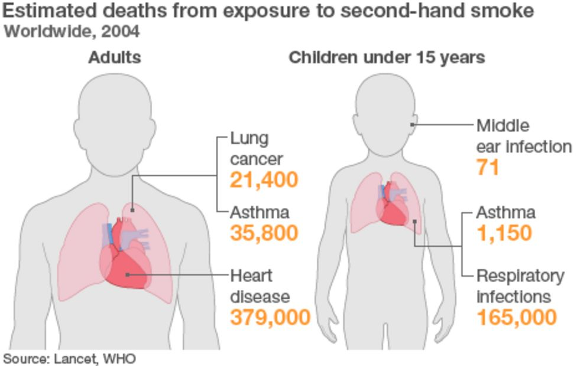

```{r, echo=FALSE}
htmltools::img(src = knitr::image_uri(file.path("uc3m.jpg")), 
               alt = 'uc3m', 
               style = 'position:absolute; top:0; right:0; padding:10px;',
               width="400",
               height="100")
```

# Lungs cancer Prediction


```{r, results = FALSE,warning=FALSE,message=FALSE}
library(ggplot2)
library(tidyverse)
library(VIM)
library(MASS)
library(caret)
library(e1071) 
library(rpart)
library(rpart.plot)
library(caret)
library(randomForest)
library(gbm)
library(corrplot)
library(glmnet)
library(olsrr)
library(kknn)
library(pROC)
library(xgboost)
```


## First approach and explanation
<center>
{width=20%}
</center>


The objectif of this homework is to be able to predict the risk of a patient to have lung cancer.  In order to do this, we will use a classification prediction of Levels of Risk. After that we will compute using regression a prediction of Risk for the patients. **In practice, this will be very interesting to evaluate quickly clients, and recommend a better lifestyle or directly a treatment for cancer.**

### 0. Risk approach


Even if the data set that we had was very interesting it had not a proper definition or formula for risk. We could think that proper scientist could evaluate the value of risk for different patients. SO we could imitate this by creating a continuous variable of risk.

*In order to solve that problem we will create a function more or less accurate to measure the risk, that function will be:*

RISK = 0.7xAge + 0xGender + 0.65xAir.Pollution + 0.63xAlcohol.use + 0.3xDust.Allergy + 0.5xOccuPational.Hazards + 0.8xGenetic.Risk + 0.55xchronic.Lung.Disease + 0.68xBalanced.Diet + 0.9xObesity + 0.65xSmoking + 0.55xPassive.Smoker + 0.40xChest.Pain +0.6xCoughing.of.Blood + 0.2xFatigue + 0.25xWeight.Loss + 0.4xShortness.of.Breath + 0.2x Swallowing.Difficulty + 0.23xClubbing.of.Finger.Nails + 0.1xFrequent.Cold + 0.27xDry.Cough +0.15xSnoring

*We have create a very linear variable which will be interesting for the analysis of the efficiency of our methods.* ***Are we going to be able to predict with an accuracy of 100% if the model is totally linear?*** *That question will be answered in the conclusion. We may add that for the rest of the homework we are oing to consider the risk variable as a variable included in the data set.*

## 1. IMPORT AND CLEANING THE DATA

We clean the variables set at seed for having always the same results of trees and import the data.
```{r}
rm(list=ls())
set.seed(123)
data = read.csv("cancer patient data sets.csv")
df=data[,-2] #We take out the patient ID
df$Level = as.factor(df$Level)
```

We have the following variables

**id**: This variable will be different for every patient and differentiate the clients.


**Age**: This is the age of the patient, usually the alder you are the most risk you have.

**Gender** : Gender of the patient 1 is male and 2 is female.

**Air.pollution** : Exposure of the patient to the air pollution (1 to 8)

**Alcohol.use**: Gives a grade to the amount of alcohol consumption (1 to 8)

**Dust.Allergy** : Indicate the amount of dust allergy of the client

**OccuPational.Hazards** : Risks due to the occupation/job of the patient.

**Genetic.Risk**: The risk given by the genetic heredity.

**chronic.Lungs.Disease**: This is the risk given by any disease.

**Balanced.Diet** : Grade of the diet because of balance and health.

**Obesity**: Level of obesity of the patient.

**Smoking** : Level of Smoking of the patient

**Passive.Smoker** : Level of passive smoking of a patient(not directly)

**Chest.Pain** : Grade of Chest pain

**Coughing.of.blood**:grade to a problem in the blood linked with lungs.

**Fatigue** : Level of fatigue of the patient.

**Weight.Loss**: This is a grade given to the ability of losing weight.

**Shortness.of.breath** : Grade given to the ability of breathing.

**Wheezing**: Level of difficulty to breath.

**Swallowing.Difficulty** : Level of difficulty to swallow of the patient

**Clubbing.of.finger.Nails**: Level of development of this desease in the patient.

**Frequent.cold**: Level of frequency of having colds of the patient.

**Dry.cought**: Level of frequency of having cought.

**Snoring**: Level of snoring of the patient.

**Level**: From 1 to 3 risk of having lung cancer.

**Risk**: Risk of the patient by the formula.

We are going to create a new column with a computed risk to have lung cancer for patients(*explained in 0.*).

```{r}
df = cbind(df, Risk =0)

for (i in 1:nrow(df)){
  df$Risk[i] = 0.7*df$Age[i] + 0*df$Gender[i] + 0.65*df$Air.Pollution[i] + 0.63*df$Alcohol.use[i] +
    0.3*df$Dust.Allergy[i] + 0.5*df$OccuPational.Hazards[i] + 0.8*df$Genetic.Risk[i] + 0.55*df$chronic.Lung.Disease[i] + 0.68*df$Balanced.Diet[i] + 0.9*df$Obesity[i] + 0.65*df$Smoking[i] + 0.55*df$Passive.Smoker[i] + 0.40*df$Chest.Pain[i] +0.6*df$Coughing.of.Blood[i] + 0.2*df$Fatigue[i] + 0.25*df$Weight.Loss[i] + 0.4*df$Shortness.of.Breath[i] + 0.2*df$Swallowing.Difficulty[i] + 0.23*df$Clubbing.of.Finger.Nails[i] + 0.1*df$Frequent.Cold[i] + 0.27*df$Dry.Cough[i] +0.15*df$Snoring[i]
}
```

We have our data set it's time to clean it properly.

### 1.2. Missing values.

We look for NA's

```{r}
barplot(colMeans(is.na(df)), las=2)
```


The dataset has no NA's, this is not a realistic thing so we are going to create our own NA's to be cleaned.
We can insert our own NA's to simulate the missing values that could appear in a usual data set.


```{r}
foo <-df$Age
 ind <- which(df$Age %in% sample(df$Age, 1))
#now replace those indices in foo with NA
 foo[ind]<-NA
#here is our vector with 15 random NAs 
 df$Age = foo
 
 # Repeting for other variables
 foo <-df$Fatigue
 ind <- which(df$Fatigue %in% sample(df$Fatigue, 2))
 foo[ind]<-NA
df$Fatigue = foo

 
 foo <-df$Dry.Cough
 ind <- which(df$Dry.Cough %in% sample(df$Dry.Cough, 2))
 foo[ind]<-NA
df$Dry.Cough = foo


 foo <-df$Wheezing
 ind <- which(df$Wheezing %in% sample(df$Wheezing, 10))
 foo[ind]<-NA
df$Wheezing = foo


 foo <-df$Alcohol.use
 ind <- which(df$Alcohol %in% sample(df$Alcohol, 1.5))
 foo[ind]<-NA
df$Alcohol.use = foo


```


We now consider the data set with the missing values as the initial one and start cleaning the data from here.

```{r}
aggr(df, numbers = TRUE, sortVars = TRUE, labels = names(df),
     cex.axis = .5, gap = 1, ylab= c('Missing data','Pattern'))
```
We can now see that there are some variables with missing values, even thought we could treat it the same way we are going to analyse the missing values for each variables.

**Age**: *has not so many missing values, so a solution could be replace it by the mean age*

**Wheezing**: *has a lot of missing values, maybe we should erase this variable*

**Alcohol.use**: *We have some missing values and we have to take into account that usually under 21 drink less(not allowed by law)*

**Fatigue** : *We have some missing values , maybe replace by the mean could be a good idea*

**Dry.Cough**: *some missing values, replacing by the mean could also be a good idea here*

It is interesting to now the number of minors in the study

```{r}
length(df[which(df$Age<18),])
```


*There are 26 minors out of 1000 patients the number is not sufficiently significant to take it into account and make a parallel analysis.*

We replace the NA's in Age variable by the mean.

```{r}
#replacing the age
average = mean(df$Age[which(is.na(df$Age)==0)])
for (i in 1:nrow(df)){
  if (is.na(df$Age[i])){
    df$Age[i] = average
  }
}
```


*We know have no NA's for the age *

We are going to replace by the mean or the mid grade for the Fatigue and for the cough.dry


```{r}
mean(df$Fatigue[which(is.na(df$Fatigue)==0)])
mean(df$Dry.Cough[which(is.na(df$Dry.Cough)==0)])
```
We can see that in a case we can replace by a 5 which is nearly the mean and the half grade. In the other case, it does not correspond, we can replace it by a 4.

```{r}
for (i in 1:nrow(df)){
  if (is.na(df$Fatigue[i])){
    df$Fatigue[i] = 4
  }
  if(is.na(df$Dry.Cough[i])){
    df$Dry.Cough[i] = 5
  }
}
```

*We have replace the NA in those two variables*

Now we are going to replace the NA for the Alcoho.use.

```{r}
adults = df[which(df$Age>17),]
minors = df[which(df$Age<18),]
mean(adults$Alcohol.use[which(is.na(adults$Alcohol.use)==0)])
mean(minors$Alcohol.use[which(is.na(minors$Alcohol.use)==0)])
```

The average in adults is 5 while the average in minors is 2. This is interesting because the difference is big enough.

```{r}
for (i in 1:nrow(df)){
  if (is.na(df$Alcohol.use[i])){
      if(df$Age[i]<18){
        df$Alcohol.use[i] = 2
      }else{
        df$Alcohol.use[i] = 5
      }}
  }
```


Once we have replaced all the NA's for those variables, we have to do something with the variable **Wheezhing**, as we said before there are not enough variable to use it as a helpful variable, so we take it out.

```{r}
df = df[,-19]
```

We can check now if there are missing values. In principle it shouldn't.


```{r}
#Missing values
barplot(colMeans(is.na(df)), las=2)
```


*As expected we can't find any missing value, we have complete this part of the work.*


### Now that we have clean variables we are going to look for outliers.


 We are going to check the possible outliers. We have a lot of numeric values but not as many are continous. We only have to check outliers for **Risk** and **Age**
 
*We do start with Age*
```{r}
QI <- quantile(df$Age, 0.25)
QS <- quantile(df$Age, 0.75)
IQR = QS-QI

sum(df$Age < QI - 1.5*IQR | df$Age > QS + 1.5*IQR)
outliers = df[which(df$Age < QI - 1.5*IQR | df$Age > QS + 1.5*IQR),2]
```

We have 10 outliers, if we check it , the outliers are the patients with more than 71 years . We know that in development of cancer the age is a **very** important factor that's why we are going to take out the outliers.

```{r}
#The outliers are the 10 people with 73 years 
df=df[which(df$Age<73),]
```

*We have taken out the outliers of age.*

*Now we are going to do the same with the risk.*
```{r}
QI <- quantile(df$Risk, 0.25)
QS <- quantile(df$Risk, 0.75)
IQR = QS-QI

sum(df$Risk < QI - 1.5*IQR | df$Risk > QS + 1.5*IQR)
outliers = df[which(df$Risk < QI - 1.5*IQR | df$Risk > QS + 1.5*IQR),2]
length(outliers)

```
*As expected there is any outlier in the risk variable, this can be logic because this value is computed with all the other components. But once again we consider that this value has been calculated by a doctor and we could not know it, that's why we had to verify the outliers.*

We have solved the problem of outliers, we can start the first Visualization approach.
#### Just before a quick univariate analysis with the summary

```{r}
summary(df)
```
We can see that a lot variables are very similar they are a  integer grade between 0 and 9. The risk is the most interesting variable we can see that it goes from nearly 30 to 100. The mean and the median are quite cimilar so the data is centered. We will check it in the visualization part. We can also add that the Risk level are well distributed nearly one third each.

## 2. Visualization tools

The variables that we are going to predict are **Risk** and **Level**, the visualization work should help us to know how those variables work and how should our approach be.

### 2.1. Amount of people for each type of Level of risk

We want to know how is the amount of people distributed in the different types of levels of lungs cancer that will be very interesting in order to know how to interpret future results.


```{r}
ggplot(df) + aes(x = Level, fill=Level ) + geom_bar() + facet_grid(~Gender)+labs(title="Levels of Risk by gender", x="Level of Risk", y="Total patients", fill="Levels") + theme(legend.position="bottom") 
```

*With this graph we can clearly see that in the number of patient evaluated there are more men. We can add that men seem to have higher possibilities of having lung cancer. The women seem to be more "healthy" because even being less there are the same number of women and men with low possibilities of having lung cancer.*


### 2.2. We are going to see the relation ship between Risk and Levels

It is interesting to see if Risk and Level are two variables taht show similar and coherent things. It should be that way, they both indicate a value of Risk.

```{r}
ggplot(df) + aes(Risk, fill= Level) + geom_density(alpha=0.5) + facet_grid(~Level)+
  labs(title="Risk of smokers by levels", x="Risk", fill="Level")
```


*With this graph we can take some conclusions. First the level and the risk seem to be very correlated. This is complete logic and it will be strange in the other case around. The people with lower risk are the ones with low probability, the ones with highest Risk are the ones with a high probability. We can also see how not all the people with the same Level have the same risk, We could think that the risk is a more precise way to evaluate the patient.*


### 2.3. Pasive Smokers VS Smokers

During last years a lot of anti-smoking laws have been created. Most of them say that the risk of developing a lung cancer in passive smokers is also very high compared to the one of smokers. We can see it in articles like the following.




First we are going to see if the number of smokers is comparable to the passive smokers. We consider a Passive smoker someone with Smoker variable < 4 and Passive Smoker Variable >4 and the Smokers are the ones with Smokers>4.

```{r}
d1 = df[which(df$Passive.Smoker>3 & df$Smoking<5),]#PASSIVE SMOKERS
d2 = df[which(df$Smoking>4),]#SMOKERS

ggplot(d1)+ aes(x = Risk) + geom_density(fill= "#C1FFC1")+
  labs(title="Risk of passive smokers", x="Risk") + theme(legend.position="bottom") 
```
```{r}
ggplot(d2)+ aes(x = Risk) + geom_density(fill= "grey")+
  labs(title="Risk of smokers", x="Risk") + theme(legend.position="bottom") 
```


*We can see clearly  how there are a lot of passive smokers between the non-smokers. But as opposite as the things that people think. "Somekers and Pasive smokers have very similar risk of having lungs cancer". This affirmation seems not to be true, in this case where the passive smokers have usually less risk than smokers.*

### 2.4. Age and Somking 

It is interesting to see the amount of smokers by age. This is also interesting to understand the problem and will be very interesting to see how the age is correlated with the levels.

```{r}
ggplot(df)+ aes(x = Age, y= Smoking, col = Level) + geom_point()+labs(title="Smoker and age", x="Age", y="Smoking", col= "Level") + theme(legend.position="bottom")
```


*With this graph it is difficult to see that the age and the smoking of each patient is not super relevant in the Level. But we can clearly see that the people that smoke has higher risks and the ones that don't have less but not low as we could think it is usually a medium risk.*

Some information say that usually the young people smoke less. This can be veryfied with a simple graph. It is not so relevant for our work but it could be interesting to understand diferent approaches.


```{r}
ggplot(d2) + aes(x = Age) + geom_density(fill = "cornsilk")+
  labs(title="Smokers by Age", x="Age") + theme(legend.position="bottom")
```


*This graph reflects that in fact young people are not the biggest group of age to smoke. In fact until the 40 the amount of smoker increases. It is also interesting to see the increase from 55 to 60, this could be a generational point or a simple coincidence.*

### 2.5. Diet and obesity variables.

We want to know how the diet and the Obesity are related between them and with the levels.

```{r}
ggplot(df) + aes(x= Balanced.Diet, y = Obesity, fill= Level) + geom_tile() + labs(title="Diet and Obesity", x="Diet Level", y="Obesity", fill= "Level") + theme(legend.position="bottom")
```


*In this graph we can confirm that usually people with very good/balanced diet have a low degree of obesity. On the other hand not all the people with low obesity seem to have a balanced diet. Another thing very surprising is that we can clearly see that **Obesity has a major influence on having lungs cancer probabilities.**. As consequence the diet should also have some influence.*


### 2.6. Life conditions

We are going to compare for different Levels for the lungs cancer in function of the Air.Pollution. We have to explain that the Air.Pollution is a factor, a variable that can not be easily modiefied. People can not chose the amount of air pollution that they breath individually.  That's why this variable is so interesting.


```{r}
ggplot(df) + aes(x = Level, y = Air.Pollution, fill = Level) + facet_wrap(~Gender)+ geom_violin(position="dodge", alpha=0.5, outlier.colour="transparent")
```

*First thing that we can say is that the Air.Pollution is not the same in function of the Gender. That is a way of seeing that the patients are very diversify they don't come from a same place. if they came from a same place they will all have the same amount of air. Pollution. More over we can say that the Air.Pollution has a big correlation with the Level Risk. The people that has less Air Pollution have in most of the cases "low" or "Medium" probabilities of having lungs cancer. The people that have higher risk usually breath more polluted air.* **We can then say that Air.Pollution and Risk will be highly correlated** *which is logic.*

### 2.7. Individual activities and Risk


We are going to see if which is the relation between individual activities/jobs which sometimes can not be choosen and the risk of having lung cancer.


```{r}
ggplot(df) + aes(x = Level, y = OccuPational.Hazards ,fill = Level) + geom_boxplot(position="dodge", alpha=0.5, outlier.colour="black")
```
*Once again we can see that* ***There is some kind of relation*** *, we can see that people with high risk have with the exception of three a very high exposure to bad conditions in their activities. People with lower exposure each day has significantly lower risk. And the Medium group is very divided but the mean is situated closer to the lower one than the higher one.*
 
### 2.8. Sortness of Breath and Allergies

We can think that the Shortness of Breath and some dust allergies can be related but more over we want to know if those variables are lineary related with the risk.

```{r}
ggplot(df) + aes(y = Dust.Allergy, x =Risk, color = Shortness.of.Breath) +geom_point()
```

*We can see that the dust allergy and the Risk could be lineary related but not by a lot and to the contrary of we could have thought the shornetness of breath is not a t all related with the dust allergy.*

### 2.9. Density of Risk

As we are going to make prediction of the risk variable it will be useful to know how is the density. We will compare it at the end with the predictions density.

```{r}
ggplot(df) + aes(x = Risk) + geom_density(fill = "aquamarine1",alpha=0.5)
```


### 2.10. CORRELATION MATRIX


Once we have made a study with some interesting variable we are going to see the correlation matrix in order to see our thought are well formed.


```{r}
X = df[,-24]
level = as.numeric(df$Level)
X = cbind(X,level)
R = cor(X)   # correlation matrix
col <- colorRampPalette(c("#BB4444", "#EE9988", "#FFFFFF", "#77AADD", "#4477AA"))
corrplot(R, method="color",  
         type="upper", order="hclust", 
         addCoef.col = NULL, # Add coefficient of correlation
         tl.col="black", tl.srt=45, tl.cex = 0.5
         , #Text label color and rotation
         # Combine with significance
         # hide correlation coefficient on the principal diagonal
         diag=FALSE 
         )
```

*We can see that in fact there are some interesting correlations. All of the health variables that usually can be interpreted as a consequence of cancer are not very correlated with the risk. While other variables that we study like the* **Smoking, Passive Smoking, Obesity, Diet, Pollution, and hazards** *are more correlated negatively, as the higher the worst. This graph gives sense to our previous study we will now continue with the classification and the regression study.*


## TRAINING and TEST sets

In order, to advance in the work we will use a training set (for finding a good approach and a test set in order to check our results). That's interesting to avoid over fitted or under fitted models. 

We could have done the visualization part with the training set. We did not because of the size of our data which could become small for teh visualization with less values.

**Usually we divide the TRAINING in 80% of data and TEST in 20%.** *Our dfTrain will be mostly use in clasification because the level is in High low medium and X data set will  be use for regression. They contain the same information.*

```{r}
spl = createDataPartition(df$Level, p = 0.8, list = FALSE)  # 80% for training

#Data set with literal levels
dfTrain = df[spl,]
dfTest = df[-spl,]

#Data set with numeric level
XTrain = X[spl,]
XTest = X[-spl,]


summary(dfTrain)
```
*We can look at a summary of the Training set. It is important to verify that the three levels are represented.*

# 3. CLASIFICATION

## 3.1. Introduction to classification.

The objective in this part of the work is to understand the importance of variables in order to determine the Risk in Levels High, Medium or Low. More over it will be interesting to be able to predict the Level Risk of a patient only knowing his health values.  


In order to understand and find a good classification we are going to try different ones and compare them. The types of classification that we are going to do are:


-**LINEAR DISCRIMINANT ANALYSIS** 

-**QUADRATIC DISCRIMINANT ANALYSIS**

-**PENALIZED LOGIC REGRESSION**

-**DECISION TREES**

-**CARET**

-**RANDOM FOREST**

## BENCHMARK MODEL

In classification and regression the first thing that we have to do is create a BENCHMARK MODEL this model is the "easy" way of classify which means that every thing that has a lower accuracy that the benchmark **is not helpful.**

```{r}
obs <- max(table(dfTest$Level))
# Accuracy:
obs/nrow(dfTest)
```
Every thing that is lower accuracy than 37% will not be taken into account. This benchmark only gives a 0.33 possibilities of making it right because there are three groups. WE can see that the accuracy corresponds with that logic. 


## 3.1. CLASIFICATION BY LINEAR DISCRIMINANT ANALYSIS


We will first use the LDA technique. As we have 3 groups we should expect 2 **LINEAR CLASSIFIERS**. We are going to check the proportion in teh levels. Having 1/3 everywhere would be the optimal thing.


```{r}
table(dfTrain$Level)
```
We have **nearly one third** in each level which is a good thing. we will use those coefficients in the classification.


```{r}
lda.model <- lda(Level ~ ., data=dfTrain[,-1], prior = c(1/3, 1/3, 1/3))
lda.model
```

We can see that the most relevant variables seem to be, **Genetic.Risk,Chest.Pain,Coughing.Blood,Snoring** and that the first level is of classification is the most relevant.

We are now going to test the prediction of that classification. We have the probability of belonging to each group and we will asign a level to each patient(**The one with highest probability**).


```{r}
probability = predict(lda.model, newdata=dfTest)$posterior
prediction <- max.col(probability)
prediction = predict(lda.model, newdata=dfTest)$class
```

We are now going to see the accuracy of the classification with a confusion matrix.

```{r}
confusionMatrix(prediction, dfTest$Level)$table
confusionMatrix(prediction, dfTest$Level)$overall[1]
```
*We can see that the accuracy is very high. This is interesting because having* ***99%*** *of accuracy is very much. We can think that it is maybe because a very linear calculation of risk in Levels that will make it very easy to classify. We can also think that the Levels are very well distinguished one from the other*


It is now very important to test other ways of prediction because we are maybe creating and over fitted model. Which predicts very well our data.


## 3.2. QUADRATIC DISCRIMINANT ANALYSIS

This kind of classification is similar to the previous one but instead of having a linear approach it has a quadratic one. Having a so good approach in the linear Approach we expect a not so good one in quadratic approach.

```{r}
#qda.model <- qda(Level ~ ., dfTrain)
#qda.model

```
When trying this kind of analysis I had several errors because of the way my data is construct. My supposition is that this model is very difficult to apply in a linear case as ours seems to be.
Nevertheless it is interesting to keep this information here.


### 3.3. PENALIZED LOGIC REGRESSION

The logic regression is a way of using the **numeric countinous** to create a classification to another variable. In this case we are going to consider that patients with **medium and High Level are "Bad"** while the others are **good**. This is an interesting way of measuring. Usually people nowadays want to have a yes or a no a good or a bad, without levels. Usually in health the patient only receives the good or bad comment never all the details. That's why this approach could also be interesting.

We are first going to create a factor for the test set.(with good and bad levels)
```{r}
data2 = c(1:length(dfTest$Level))
for (i in 1:length(data2)){
  if (dfTest$Level[i] =="High"| dfTest$Level[i]== "Medium"){
    data2[i] = "Bad"
  }else{
    data2[i] = "Good"
  }
}
data2 = as.factor(data2)
```

Once we have the levels we can make the prediction using glmt and see the results.


```{r}
logit.model <- glmnet(as.matrix(dfTrain[,-c(1,24)]),dfTrain$Risk, alpha=0, lambda=0.01)
probability <- predict(logit.model,as.matrix(XTest[,-c(1,24)]), type='response')
prediction <- as.factor(ifelse(probability > 5.5,"Bad","Good"))
confusionMatrix(prediction, data2)
```

We have and accuracy of **87%** but a sensitivity of **99%**. This is very relevant because in health we always want to detect the dangerous cases. The sensitivity is the most important thing. That's why this model is very interesting.


### The ROC curve

We can plot a ROC curve to see how this model is balanced. We can precise that the more area under the curve the better our model is.

```{r, results = FALSE,warning=FALSE,message=FALSE}
model <-  glmnet(as.matrix(dfTrain[,-c(1,24)]),dfTrain$Risk, alpha=0, lambda=0.01)
probability <- predict(logit.model,as.matrix(XTest[,-c(1,24)]), type='response')
roc.lda <- roc(data2,probability[,1])
```
```{r}
auc(roc.lda) 
```
The area under the curve seems pretty interesting and it correspond well too the model studied before. 

```{r}
plot.roc(data2, probability[,1],col="darkblue", print.auc = TRUE,  auc.polygon=TRUE, grid=c(0.1, 0.2),
         grid.col=c("green", "red"), max.auc.polygon=TRUE,
         auc.polygon.col="lightblue", print.thres=TRUE)
```


We can see that the area under the curve is pretty good, we are not going to test it with the linear discriminant model because it doesn't seem interesting the accuracy is extremely high. 


### 3.4. DECISION TREES

Another way of classification is the decision tree. This kind of classification is very interesting also in understanding the relevance of variables that usually go from hight to low. The are different way of using decision trees and this homework we are going to see three different ones. And check which one is more interesting in this case. 

We are going to use a min split of 20 which is the usual thing and then change some parameters from max depth 10 to 20 and cp from 0.01 to 0.001.

```{r}
# Hyper-parameters
control = rpart.control(minsplit = 30, maxdepth = 10, cp=0.01)

# minsplit: minimum number of observations in a node before before a split
# maxdepth: maximum depth of any node of the final tree
# cp: degree of complexity, the smaller the more branches

model = Level~.
dtFit1 <- rpart(model, data=dfTrain, method = "class",control = control)
rpart.plot(dtFit1, digits=3)
```
We can see in this tree that the relevant variables are not the ones that we did selected before. Here the variables are **Pasive.Smoker, Shortness.Breath Swallowing difficulty.**. This is intresting we are going to test the accuracy in order to compare the classifications.

We are going to predict 
We apply k-folds to find the best hyper parameters

```{r}
folds = createFolds(dfTrain$Level, k = 4)

# We train our classification tree using function r part
#We create the parameters to the hyper parameters research for the best model(tree)
d_minsplit=seq(from=10, to= 100,by=10)
d_maxdepth = seq(from=1, to = 30, by = 2)
d_cp = 2^(-11:-1)
paramet= expand.grid(d_minsplit, d_maxdepth, d_cp)


#With this function we test the hyperparameters
cv_hyper = apply(paramet, 1, function(y){
  cv = lapply(folds, function(x) {
    
    # We select training and test set according to the k-cross Validation
    training_set = df[-x,]
    test_set = df[x,]
    #We built the tree 
    mytree=rpart(formula=Level ~.,
                 data=training_set, method="class", 
                 control = rpart.control(minsplit = 
                                           y[1], maxdepth = y[2], cp = y[3]))
    #With the pred() we tree to predict the variable Survived
    pred = predict(mytree,test_set,type="class")
    # Compute the confusion matrix, to verify the accuracy
    conf_matrix = table(test_set$Level,pred,
                        dnn=c("Actual value","Classifier prediction"))
    conf_matrix_prop = prop.table(conf_matrix)
    
    # We compute the accuracy precision and specificity even if they 
    #not all interest us
    accuracy = sum(diag(conf_matrix))/sum(conf_matrix)
    precision = conf_matrix[1,1]/sum(conf_matrix[,1])
    specificity = conf_matrix[2,2]/sum(conf_matrix[,2])
    return(c(accuracy,precision,specificity))
  }) 
  cv = t(matrix(unlist(cv),nrow=3))
  return(cv)
})
```

We now have tested different hyper parameters with k-folds technique i.e. changing several times the training and data set. The hyper parameters that we will have will be the best ones.


```{r}
a = cv_hyper[,which(cv_hyper[1,]<1)]
accuracy = a[1,]
plot(accuracy)

#We see the best accuracy 

a[1, which.max(a[1, ])]
max(a[1, ])

#We take the parameters of the model with the best:
#Accuracy
acc = paramet[which.max(a[1, ]),]

#Here the precision and the specificity doesn't interest us because we had 
#decided like this. But it is interesting to verify this data.

#Precision
paramet[which.max(a[2, ]),]
#Specificity
paramet[which.max(a[3, ]),]  

```
We now have the best parameters for a regresion tree. 

We can now see the best model. 10, 5 ,0.000004882812

**We are going to plot the best decision tree that we could find**

```{r}
control = rpart.control(minsplit =acc[,1], maxdepth = acc[,2], cp=acc[,3])

# minsplit: minimum number of observations in a node before before a split
# maxdepth: maximum depth of any node of the final tree
# cp: degree of complexity, the smaller the more branches

model = Level ~.
dtFit2 <- rpart(model, data=dfTrain[,-25], method = "class", control = control)
summary(dtFit2)
rpart.plot(dtFit2, digits=3)
```


*We can see that the important variables are the ones already mentioned* (**Passive.Smoker, Smoking, Alcohol.use, Chest.Pain, Balanced.Diet, Shortness.of.Breath, Air.Pollution, Obesity**) We are now going to test the prediction in order to find the accuracy.

### Prediction

```{r}
dtProb <- predict(dtFit2, dfTest[,-25], type = "prob")
threshold = 0.2
dtProb <- prediction <- max.col(dtProb)
fc = as.factor(as.numeric(dfTest$Level))
CM = confusionMatrix(factor(dtProb), fc)$table
confusionMatrix(factor(dtProb), fc)$overall[1]

```


With this best possible model of tree we find an accuracy of nearly **98,9%**, which is also very very high. This one is similar to the linear discriminate analysis. We can start to think that this data set is easily predictable but we have to be careful with the over fitting.


## CARET

We are going to test another kind of tree in this case we will use the same hyper parameters that we fund before., the caret library makes a similar work to the one we have done with k-folds.

```{r}
caret.fit <- train(model, 
                   data = dfTrain[,-25], 
                   method = "rpart",
                   control=rpart.control(minsplit = acc[,1], maxdepth = acc[,2]),
                   trControl = trainControl(method = "cv", number = 5),
                   tuneLength=10)
caret.fit
rpart.plot(caret.fit$finalModel)

```


*The caret method finds a similar tree with a similar accuracy, that confirms the work done in the previous step.*

We are going to test the pprediction of this new model, we expect it to be similar to the one found in the previous step.

```{r}
dtProb <- predict(caret.fit, dfTest[,-25], type = "prob")
threshold = 0.2
dtProb <- prediction <- max.col(dtProb)
CM = confusionMatrix(factor(dtProb), fc)$table
confusionMatrix(factor(dtProb), fc)$overall[1]
```
As expected, we find the same accuracy which is normal because we use the same parameters hence we have the same tree.

We can try to see the variable importannce of this model.

```{r}
lr_imp <- varImp(caret.fit, scale = F)
plot(lr_imp, scales = list(y = list(cex = .95)))
```


*Those are the different variables and their importance in the caret method. We can notice that some of the most relevant variables are different to the ones that we thought that would be.* 


## RANDOM FOREST


The random forest is a way of classifying that uses a lot of decision trees it is harder to know the importance of each variable. We have seen that the data can be easily over fitted that's why we are going we are going to use different folds and hyper parameters to be able to find erors and create a less over fitted model. We have seeing that our levels are very well distinguished.


```{r}
rf.train <- randomForest(Level ~., data=dfTrain[,-25], ntree=500,mtry=23)
rf.pred <- predict(rf.train, newdata=XTest[,-25])
confusionMatrix(rf.pred, dfTest$Level)

```

*We observe that the accuracy is of 1, which is very strange even if the data seemed really easy to predict. After thinking about it, we can try to apply k folds to te random forest. If the accuracy is still one we'll consider that this data was very easily predictable.*

We apply the k-fold cross validation:

```{r}
# Applying k-Fold Cross Validation
# We train our classification random forest using function randomForest
# We select the Hyper parameter 
#The numbers of variables is 7 so we can do  it until 6
d_mtry=seq(from=2,to=6,by=1)
d_ntree=seq(from=100,to=200,by=50)
parameters = expand.grid(mtry=d_mtry,ntree=d_ntree)

# Create the folds
nfold = 3
n = nrow(df)
folds = sample(rep(1:nfold,length.out=n))

# Create the matrix for storing the values of accuracy of each model 
# in each iteration
accuracies = matrix(NA,nfold,nrow(parameters))

for (i in 1:nfold){
  # Split into train and test, here we do it in another way
  train = df[folds != i,-25]
  test = df[folds == i,-25]
  
  # Fit and evaluate every model
  for (j in 1:nrow(parameters)){
    rf = randomForest(Level~.,train,mtry = parameters$mtry[j],
                      ntree = parameters$ntree[j])
    #We use the function pred() 
    pred = predict(rf,test,type="class")
    
    accuracies[i,j]  = sum(pred == test$Level)/length(pred)
  }
}

parameters$acc = apply(accuracies,2,mean)
#We can plot the accuracy in function of the different hyperparameters
ggplot(parameters) + aes(x = mtry, y = acc, color=as.factor(ntree)) + geom_line(size=1) + geom_point(size=3) + 
  theme(text = element_text(size=14)) + labs(color="No. of trees",y = "Accuracy", x = "No. of variables")

#We can also use the plot of accuracy to have a first impression
accuracy = parameters$acc
plot(accuracy)

# acc are the parameters for the most accurate random forest
acc = parameters[which.max(parameters$acc),]
#We create th best random forest with the parameters of the best hyper parmeters
bestclassifier = randomForest(formula = Level~., 
                              data = dfTrain[,-25] , mtry = acc[,1] , ntree = acc[,2])

#We can even plot the errors.
plot(bestclassifier)


```

*Even using k-fold cross validation we achieve an accuracy of 1. So we can conclude that our model is easily predictable because the different levels are very separated.*

```{r}
varImpPlot(bestclassifier)
```

*We can see that the relevant variables are more or less similar to the ones of the decision tree and the caret decision tree. That is Coughing of Blood Balanced Diet Obesity between others. We can see that even if most of the variables recognised as symptoms even if other as Clubbing of Nails for example is very relevant.*

## CONCLUSION CLASIFICATION

In this conclusion we can that our data seams very easy over fitted or predict which makes the good results in accuracy a little bit suspicious. The data has also very distinguish Levels that are hence easy to predict. Nevertheless we can also say that we have obtain very good in prediction in methods as decision trees or LDA. More over we also have achieved a Very good result in specificity with Penalized Logic Regression.
 
*If we had to choose a way of prediction it would be the random forest or Logistic Penalized Regression for the specificity. And if we had to draw a conclusion about the relevant variables it would be the ones that are not symptoms but accions recieved by the patient.*


# REGRESSION

The regression modelling is a way of prediction a continous variable. In  this case we are going to predict the Risk. It is important, to remember that even if we have created the variable, we are to take it as if we don't know it.  In the conclusion, we will compare the results but not during the regression study.

During this part of the Homework we will see different models, and compare their results. The methods used will be the following:

-**Logarithmic approach**

-**Simple linear model**

-**Multiple Regression**

-**Linear Regression**

-**Overfitted linear regression**

-**Foward Regression**

-**Backawrd regression**

-**LASSO**

-**K-nearest-neighbours**

-**GRADIENT BOOSTING recurssion**


We can plot the variables correlation to see how much important is each variable.

```{r}
corr_delay <- sort(cor(XTrain[,c(2:24)])["Risk",], decreasing = T)
corr=data.frame(corr_delay)
ggplot(corr,aes(x = row.names(corr), y = corr_delay)) + 
  geom_bar(stat = "identity", fill = "lightblue") + 
  scale_x_discrete(limits= row.names(corr)) +
  labs(x = "", y = "risk", title = "Correlations") + 
  theme(plot.title = element_text(hjust = 0, size = rel(1.5)),
        axis.text.x = element_text(angle = 45, hjust = 1))
```

*We can see something very intresting the variables which are more relevant are not the same that we have seen in the clasiffication approach. This is in one hand normal because it is not the same variable that we are studying. Nevertheless the two variables have a lot in common as we have seen in the visualization approach.

### BENCHMARK MODEL

Once again we will try a benchmark model to know the accuracy that we need to have at least in our model in order to be usefull.

```{r}
mean(XTrain$Risk)
```

```{r}
benchFit <- lm(Risk ~ 1, data=XTrain)
benchFit$coefficients #This should be the mean
predictions <- predict(benchFit, newdata=XTest)
sqrt(mean((predictions - XTest$Risk)^2))
```

*The benchmark has a result of 15.6 This will be very interesting when comparing the effectiveness of other methods.*

### LOGARITHMIC APPROACH

For the regression we are going to create diffrent model with increasing complexity in order **to approach the most accurate one**.
The genetic Risk seems the most important variable. We could think that it has an exponential effect on Risk. 
*That's why we are going to test a very easy model with that caracteristic.*


```{r}
linFit <- lm(log(Risk) ~ log(Genetic.Risk), data=XTrain)
summary(linFit)

```
*We can observe that the R-squared is of 0.52 which is kind of good. But maybe could be better with a linear model. In fact the Level depended a lot on linearity.*

```{r}
par(mfrow=c(2,2))
plot(linFit, pch=23 ,bg='orange',cex=2)
```


We can see that the model residuals seem coherent in themiddle cases but not in **the lower and higher ones**. This could clearly mean thatwe should try a linear model. But before lets try to see how this model predicts our data odf the Testset.

```{r}
pr.simple = exp(predict(linFit, newdata=XTest))
cor(XTest$Risk, pr.simple)^2
```
As we expected a 63% of accuracy which is not bad but we can improve it.

### SIMPLE LINEAR MODEL

We consider the same approach but linear. We take the most correlated variable and compute a linear model.

```{r}
linFit <- lm((Risk) ~ Genetic.Risk, data=XTrain)
summary(linFit)
pr.simple = (predict(linFit, newdata=XTest))
cor(XTest$Risk, pr.simple)^2
```
With this model we arrive to a very **better result with R2 of 0,63**, so it is not the type of a pproach but the fact that we are only using one variable. That's why we are going to take a multiple regression approach.

### Multiple Regresion 

With this multiple regression we are going to take into account more interesrting variables at least the first 5 ones.
This first model is very easy it has a simply linear approach and if the results are not good we will change to a most sofisticated one.


```{r}
linFit <- lm(Risk ~ Genetic.Risk + OccuPational.Hazards + chronic.Lung.Disease + Obesity + Alcohol.use , data=XTrain)
summary(linFit)
```

### Prediction 

```{r}
predictions <- predict(linFit, newdata=XTest)
cor(XTest$Risk, predictions)^2
```
We can clearly see that with this approach the **accuracy has significantly increased**.

We could think what would happen if we put all the variables in a single model. We use a simple linear model because as we saw in the visualization part the data seemed linearly related.

```{r}
modelall = Risk ~ Genetic.Risk + OccuPational.Hazards + chronic.Lung.Disease + Obesity +Gender + Air.Pollution + Alcohol.use + Dust.Allergy + Balanced.Diet + Smoking + Passive.Smoker + Chest.Pain + Coughing.of.Blood + Fatigue + Weight.Loss + Shortness.of.Breath + Swallowing.Difficulty + Clubbing.of.Finger.Nails + Frequent.Cold + Dry.Cough + Snoring

linFit <- lm(modelall, data=XTrain)
predictions <- predict(linFit, newdata=XTest)
cor(XTest$Risk, predictions)^2
```
We can observe a very high correlation in the predictions but it is maybe improvable. Hence this kind of model with so many variables is not so interesting because it **adds alot of computational cost for not so many accuracy**. We add only 5 percent of accuracy but more or less 18 variables. Nevertheless it was interesting to test it.

We can now observe the errors graphs to compare.
```{r}
par(mfrow=c(2,2))
plot(linFit, pch=23 ,bg='orange',cex=2)
```

We can see that the residuals seem a little better, even if we have the same problem for the extreme values.

### SELECTION OF THE MODEL

We are going to select the model with the variables that we found interesting and with a pretty good accuracy before.
```{r}
model = Risk ~ Genetic.Risk + OccuPational.Hazards + chronic.Lung.Disease + Obesity + Alcohol.use
linFit <- lm(model, data=XTrain)
```


**Now we have to select the best model**

```{r}
modelresult = ols_step_all_possible(linFit) #We store all the possible subsets just in case.
ols_step_best_subset(linFit)
```

*We can now plot some interesting graphs about tose models*

```{r}
plot(ols_step_forward_p(linFit))
```


We can see that the higher the model the higher the accuracy and the lower the errors that makes of it a very accurate model but also potentially an over fitted one.


### Statistical learning tools in REGRESSION

*Until now we had used a very easy to understand regression prediction. To find a model. We could easy change the variables taken into account. Now with the statistical learning tools we should be able to compute more accurate models and compare different precisions in order to find the best model.*
We are going to use a control function for our models. 

```{r}
ctrl <- trainControl(method = "repeatedcv", 
                     number = 5, repeats = 2)
```

This function will repeat the process two times of creating 5 diferent training sets. This is use with caret in order to avoid having over fitted model for a training set, we create and test several training set as if we had " bigger data".


### LINEAR REGRESSION

We are going to create a vector where we store the results of the test. At first we fill it with the values of the Risk.

```{r}
test_results <- data.frame(Risk = XTest$Risk)
```

We are going to try first with a linear regression model.
```{r}
lm_tune <- train(model, data = XTrain, 
                 method = "lm", 
                 preProc=c("scale", "center"),
                 trControl = ctrl)
lm_tune
```

*Even if it is slighlty we can already see that our value for R-squared is better that for the normal linear model.*
We can test the accuraccy to be able to compare.


```{r}
test_results$lm <- predict(lm_tune, XTest)
postResample(pred = test_results$lm,  obs = test_results$Risk)
```

```{r}
qplot(test_results$lm, test_results$Risk) + 
  labs(title="Linear Regression Observed VS Predicted", x="Predicted", y="Observed") +
  lims(x = c(40, 100), y = c(40,100)) +
  geom_abline(intercept = 0, slope = 1, colour = "blue") +
  theme_bw()
```

*We can see a bias. But it is even more interesting that we can perfectly differentiate the three levels.We can also add taht the values with higher Risk are more easy to predict than the other ones.*

### Overfitted linear regression

We can try an over fitted model that for sure is not going to be the most useful one but it can be interesting to compare it with other models.

```{r}
alm_tune <- train(model, data = XTrain, 
                  method = "lm", 
                  preProc=c('scale', 'center'),
                  trControl = ctrl)
```


```{r}
test_results$alm <- predict(alm_tune, XTest)
postResample(pred = test_results$alm,  obs = test_results$Risk)
```


```{r}
qplot(test_results$alm, test_results$Risk) + 
  labs(title="Linear Regression Observed VS Predicted", x="Predicted", y="Observed") +
  lims(x = c(40, 90), y = c(40, 90)) +
  geom_abline(intercept = 0, slope = 1, colour = "blue") +
  theme_bw()
```


The difference between the two models is not so big. We have less bias and same Rsquared just because we have a more over fitted model but that does not give us exactly more accuracy.

### Foward Regression

Once we have used linear regression we can test the foward regression which consist in starting with a empty model and adding variables one by one, this bethod belongs to the stepwise regression methods, with change the model step by step. In this case we are going to use the model with all the variables. To be able to understant how many are relevant enought.

```{r}
for_tune <- train(modelall, data = XTrain, 
                  method = "leapForward", 
                  preProc=c('scale', 'center'),tuneGrid = expand.grid(nvmax = 4:22), trControl = ctrl)
```

```{r}
plot(for_tune)
```

We can clearly see that teh more variables the best. In fact, this is true until the 18th variable. We are now going to see which ones are the most relevant ones.


```{r}
coef(for_tune$finalModel, for_tune$bestTune$nvmax)
```
Those are the most relevant variables.
```{r}
lr_imp <- varImp(for_tune , scale = F)
plot(lr_imp, scales = list(y = list(cex = .95)))
```

```{r}
test_results$seq <- predict(for_tune, XTest)
postResample(pred = test_results$seq,  obs = test_results$Risk)
```

*We can observe a considerably higher Rsquared than in the previous models and a lower RMSE. We will always choose this model over the previous ones. We have also the most relevant variables and it could be interesting to compare them with the ones of the backward regression.*


```{r}
test_results$bw <- predict(for_tune, XTest)
qplot(test_results$bw, test_results$Risk) + 
  labs(title="Backward Regression Observed VS Predicted", x="Predicted", y="Observed") +
  lims(x = c(40,100), y = c(40,100)) +
  geom_abline(intercept = 0, slope = 1, colour = "blue") +
  theme_bw()
```

### Backawrd regression

This kind of regression also belongs to the same kind of step wise regression. But this time instead of adding the variable we start with all the variables and we take them out one by one.
```{r}
back_tune <- train(modelall, data = XTrain, 
                  method = "leapBackward", 
                  preProc=c('scale', 'center'),tuneGrid = expand.grid(nvmax = 4:22), trControl = ctrl)
```

We are going to plot how many variables make the more accuracy.

```{r}
plot(for_tune)
```
```{r}
lr_imp <- varImp(back_tune , scale = F)
plot(lr_imp, scales = list(y = list(cex = .95)))
```


*We have a very similar one than the previous one. SO we will take the relevant variables from the previous studies. We can also add that the first 10 variables are very relevant in comparison to the rest ones.* *The relevant variables are the same than for forward regression, we will use the foward model over the backward one.*


### STEP-wise regression

This kind of regression is also made in steps as the previous ones. It first test linear variables then crosses the products.  We want to know if this kind of study is better or not in prediction.

```{r}
step_tune <- train(modelall, data = XTrain, 
                   method = "leapSeq", 
                   preProc=c('scale', 'center'),
                   tuneGrid = expand.grid(nvmax = 4:18),
                   trControl = ctrl)
plot(step_tune)
```


*We can clearly see a similar result here than in the foward regression. We can see that the best is taking into account 16 variables but if we take 9 we have a very similar result with less variables.*

```{r}
coef(step_tune$finalModel, step_tune$bestTune$nvmax)
```


*The relevant variables are the same ones.*

```{r}
test_results$seq <- predict(step_tune, XTest)
postResample(pred = test_results$seq,  obs = test_results$Risk)
```
*We can see that the results are very similar to the previous results, so we are going to keep the foward model but these 2 are very similar.*

### RIDGE REGRESSION


Ridge regression is very helpful when the independent variables are very correlated. In our data no all the variables are highly correlated, but some of the most important seemed to be(as we have seem in the visualization part.)


```{r}
# X matrix
X = model.matrix(model, data=XTrain)[,-1]  # skip column of id

# y variable
y = log(XTrain$Risk)
grid = seq(0, 1, length = 1000)  # a 100-size grid for lambda (rho in slides)
ridge.mod = glmnet(X, y, alpha=0, lambda=grid)  # alpha=0 for ridge regression
dim(coef(ridge.mod))
plot(ridge.mod, xvar="lambda")
```

*This graph confirms pretty well the our thought that the Risk is calculate linearly.*

We want to select the best hyper parameter.

```{r}
ridge.cv = cv.glmnet(X, y, type.measure="mse", alpha=0)
plot(ridge.cv)
```


As we want to minimize the Mean-Square Error the best landa will be the one with the less part of the curve, it seems that it will be near -4. the log odf lamda can be between -4 and -3 aproximatevelly.

```{r}
opt.lambda <- ridge.cv$lambda.min
opt.lambda
```
```{r}
lambda.index <- which(ridge.cv$lambda == ridge.cv$lambda.1se)
beta.ridge <- ridge.cv$glmnet.fit$beta[, lambda.index]
beta.ridge
```

*We can appreciate that this model changes a little bit the coefficients*

We are going to test the model now.

```{r}
X.test = model.matrix(model, data=XTest)[,-1]  # skip column of ones
ridge.pred = predict(ridge.cv$glmnet.fit, s=opt.lambda, newx=X.test)
```

```{r}
y.test =XTest$Risk
postResample(pred = ridge.pred,  obs = y.test)
```

*We can see that the Rsquared is considerably less than the ones obtained with the step wise regression and the step foward so if we had to predict the risk f a Patient we would use the ones mentioned.*

We will use caret in the ridge regression in order to find something better.
The caret regression changes some hyperparameters in order to find a better model.
```{r}
# the grid for lambda
ridge_grid <- expand.grid(lambda = seq(0, .1, length = 100))

# train
ridge_tune <- train(modelall, data = XTrain,
                    method='ridge',
                    preProc=c('scale','center'),
                    tuneGrid = ridge_grid, trControl=ctrl)

plot(ridge_tune)
```

**We look for the best tune, with caret.**
```{r}
ridge_tune$bestTune
```

**We make the prediction for this model.**
```{r}
test_results$ridge <- predict(ridge_tune, XTest)
postResample(pred = test_results$ridge,  obs = test_results$Risk)
```
*We can now see the accuracy that we had before a slightly better one. The Rsquared and the RMSE are lower and higher thna the foward regression even if they are very simila, we are going to use Foward regression.*


### LASSO

The LASSO technique which variables selection and approximation in order to determine a better prediction.

```{r}
lasso_grid <- expand.grid(fraction = seq(.01, 1, length = 200))
lasso_tune <- train(modelall, data = XTrain,
                    method='lasso',
                    preProc=c('scale','center'),
                    tuneGrid = lasso_grid, trControl = ctrl)
plot(lasso_tune)
```

**We look for the best hyper parameters**

```{r}
lasso_tune$bestTune
```

**We use them now to make the prediction.**
```{r}
test_results$lasso <- predict(lasso_tune, XTest)
postResample(pred = test_results$lasso,  obs = test_results$Risk)
```

*We have less RSquared than with ridge regression, this is maybe due because of the fact that we have tried less hyper-parameters.*


### ELASTIC REGRESSION

This method combines the lasso and ridge method it shoud have better Rsquared results.

```{r}
modelLookup('glmnet')
elastic_grid = expand.grid(alpha = seq(0, .2, 0.01), lambda = seq(0, .1, 0.01))

glmnet_tune <- train(modelall, data = XTrain,
                     method='glmnet',
                     preProc=c('scale','center'),
                     tuneGrid = elastic_grid, trControl = ctrl)

plot(glmnet_tune)
```

**We search for the best hyper-parameters**
```{r}
glmnet_tune$bestTune
```

**We look for the prediction .**
```{r}
test_results$glmnet <- predict(glmnet_tune, XTest)
postResample(pred = test_results$glmnet,  obs = test_results$Risk)
```
*We can see that as expected teh Rsquared value is higher that the previous ones* **For the moment it is the best model we could find**

We can see which vvariables are relevant in this case.
```{r}
lr_imp <- varImp(back_tune , scale = F)
plot(lr_imp, scales = list(y = list(cex = .95)))
```


*Once again we can see that the same variables are relevant, It is interesting to see that Passive Smoker is more relevant than Smoker. This goes against our conclusions in the visualization part.*

## MACHINE LEARNING

After the statistical tools, we use the Machine Learning ones. We could think :

*Which is the diffrence?* 

In fact for statistical tools we can trace back how the calculus were done, with machine learning we only have the result.

#### KNN

This way of studing regression searches for the nearest neighbors and make calculus from there.

```{r}
modelLookup('kknn')
```

```{r}
knn_tune <- train(modelall, 
                  data = XTrain,
                  method = "kknn",   
                 preProc=c('scale','center'),
                  tuneGrid = data.frame(kmax=c(7,9,11,13,15,19,21,23),distance=2,kernel='optimal'), 
                 trControl = ctrl)
plot(knn_tune)
```
*We can clearly see that the most interesting result is achieved with 19 neighbors

*We now make the prediction*
```{r}
test_results$knn <- predict(knn_tune, XTest)
postResample(pred = test_results$knn,  obs = test_results$Risk)
```
*We can clearly see that the the RSquared is much higher and the RSMe is lower. This is a much better model.*

```{r}
lr_imp <- varImp(knn_tune, scale = F)
plot(lr_imp, scales = list(y = list(cex = .95)))
```
*We can see that the most relevant variables are very similar to the ones we have already seen. The* **alcohol Risk** *is the variable that has gained more importance with this method.*

### RANDOM FOREST

We have already use the random forest for classification, this time we will use it for Regression.

```{r}
rf_tune <- train(modelall, 
                 data = XTrain,
                 method = "rf",
                 preProc=c('scale','center'),
                 ntree = 200,
                 importance = TRUE, trControl = ctrl)
```

```{r}
test_results$rf <- predict(rf_tune, XTest)
postResample(pred = test_results$rf,  obs = test_results$Risk)
```
*We have the best RSquared for the moment. Once again it is more difficult to understand the calculations. But we can plot the relevant variables to understand it better. We suppose that the variable importance should be the same than for the classification part.*

```{r}
lr_imp <- varImp(rf_tune, scale = F)
plot(lr_imp, scales = list(y = list(cex = .95)))
```


*It is very interesting to see that except the genetic Risk the other variables are changing positions. That is a good example of how 2 machine learning methods obtain similar results using totally different ways. Nevertheless the more relevant variables are still similar. It is interestuing to see that now smokekings ir more relevant thant passive smoking.*


### GRADIENT BOOSTING recurssion

```{r, results = FALSE,warning=FALSE,message=FALSE}
xgb_tune <- train(modelall, 
                  data = XTrain,
                  method = "xgbTree",
                  preProc=c('scale','center'),
                  #objective="reg:squarederror",
                  trControl = ctrl,
                  tuneGrid = expand.grid(nrounds = c(10,300), max_depth = c(5,6,7), eta=c(0.01,0.1, 1),gamma = c(1, 2, 3), colsample_bytree = c(1, 2),min_child_weight = c(1), subsample = c(0.2,0.5,0.8)))
```
```{r}
test_results$xgb <- predict(xgb_tune, XTest)

postResample(pred = test_results$xgb,  obs = test_results$Risk)
```

### CONCLUSION REGRESSION


After seeing all the differents techniques we are able to compare them and predict the results in the best way possible. Selecting the methods with the least mean squared error we are going to cgoose the predictors, and finally predict the data.

```{r}
apply(test_results[-1], 2, function(x) mean(abs(x - test_results$Risk)))
```

*At this point we want to minimize the MAE but make some combination in order not to make an over fitted  choice.***The ones with minimal MAE are rf knn** We will choose those ones to predict our values.

```{r}
test_results$comb = ( test_results$knn + test_results$rf+ test_results$xgb)/3
yhat = (test_results$comb)
hist(yhat, col="lightblue")
```
We can see that the results are kind of symmetric which is a good thing. It has alot of similitudes with the density of Risk that we plotted at the beggining. So we are going to consider those results as usefull. We are now going to compute the incertitude to know how accurate was our prediction.

We look for the incertitude limits, it will be useful for plotting the results.
```{r}
y = test_results$Risk
error = y-yhat
noise = error[1:100]
lwr = yhat[101:length(yhat)] + quantile(noise,0.05, na.rm=T)
upr = yhat[101:length(yhat)] + quantile(noise,0.95, na.rm=T)
predictions = data.frame(real=y[101:length(y)], fit=yhat[101:length(yhat)], lwr=lwr, upr=upr)
predictions = predictions %>% mutate(out=factor(if_else(real<lwr | real>upr,1,0)))
```


```{r}
ggplot(predictions, aes(x=fit, y=real))+
  geom_point(aes(color=out)) + theme(legend.position="none") +
  xlim(25, 110) + ylim(25, 110) + geom_ribbon(data=predictions,aes(ymin=lwr,ymax=upr),alpha=0.1) +
  labs(title = "Prediction intervals", x = "prediction Risk",y="real Risk")
```
*We can see that we have very very accurate predictions, this can be explained as we will do in the conclusion because of us taking into creating the Risk variable* 

In conlusion we can say that the work we have done with all kinds of regression has lead us to best approaches. Those ones have led us to a good prediction with the help of the linearity that the Risk seems to have with the data.

**It is relevant to say that the best approach are the ones of machine learning but their are more difficult to understand.**

*In a lot of the models the most relevant variables are Genetic Risk Occupational Hazard Alcohol use smoking or passive smokers. The variables that influence the less are the ones that seem more a symptoms than acctions.*


# CONCLUSION

First thing we can say is that as we thought the lineal model is very well predicted. But nevertheless the accuracy is very similar between the Levels of Risk and the Risk which shows that the risk computed is pretty realistic. 

Moreover, In most of the cases the relevant values are the ones with a higher coefficient in the linear model created at the begging. That shows once again how good the model is predicted.

In fact this exercise, is very interesting. **We could thing why if we have created a linear dependent variable we are not able to find a perfect result?**

This is interesting and it was not easy to find an answer.But we can think of an explanation. The Risk variable was the first think we introduced. After that step, we introduced the NA's to be able to correct them. As a result we had some variables of Risk that were not perfectly linear. And if we would have done or work very good those NA's replaced shouldn't be seen. But the replacement of NA' s is not always perfect. We can then suppose that the Values outside are some of the ones with NA's.

**That shows the relevance of replacing NA's in a good way**


### Sources

As for the previous work, we have taken some of the code presented in the practical cases explaining the different approaches.

pictures: Is source not precised, source Wikipedia

dataset: Kaggle


